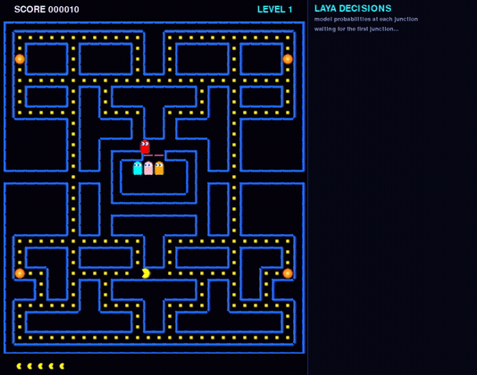

# Laya-Pacman

**An autonomous gameplay testbed: the engine computes the facts, Laya makes the strategic choice.**

A watch-only neon Pac-Man for the classic 28×31 maze. Four ghosts actively hunt; Pac-Man's
turning decisions are made by the local [Laya](https://huggingface.co/convaiinnovations/laya)
decision model running **in-process on CUDA** — no HTTP, no sidecar, no CPU fallback.
Nobody plays Pac-Man: you watch Laya play, and the live panel beside the maze shows every
decision it makes.



A full game to game over (seed 0, 1025 steps, final score 4590, level 2), showing the smooth
interpolated movement and the live **LAYA DECISIONS** panel (source, personality mode,
per-move probabilities, latency). Record your own:

```bash
uv run --with imageio --with imageio-ffmpeg python game.py --record demo.mp4
```

## What it is

- **Classic maze**: 28×31, 240 pellets + 4 energizers, ghost house, side tunnels, no dead ends.
- **Pac-Man**: tile-by-tile movement; at every junction (≥2 legal non-reverse moves) the
  decision pipeline chooses the direction. Corridors and corners are forced.
- **Ghosts**: red/pink/cyan/orange. They leave the house on a staggered timer, never reverse,
  and **hunt** — 80 % of steps they take the true shortest path to Pac (`--chase` to tune),
  otherwise a random legal neighbour. Frightened ghosts wander randomly and are edible;
  eaten ghosts return home as eyes and respawn.
- **Rules**: 5 lives (`START_LIVES`), level speed-up ×0.95, power pellets frighten for
  7 s (−0.5/level, floor 2 s, blinking at the end), score 10/50/200.
- **Keys**: `Esc` quit · `P` pause · `R` restart. No keyboard control for Pac-Man.

## Architecture

```
game.py            pygame loop, tile engine, ghost AI, renderer + LAYA DECISIONS panel
   │  junction (≥2 legal moves)
   ▼
brain.py           choose(game, legal) -> (move, source)
   ├─ features      BFS fields: pellet / power / deadly / edible distances, zone counts,
   │                exploration coverage, closing detection  (engine owns ALL pathfinding)
   ├─ memory        rolling 16-junction window, visit counts with decay, loop detector
   │                (cycle periods 2/3/4, repeated (tile, entered-from), stagnation)
   ├─ controllers   danger > loop > chase > Laya   (deterministic, never reverse except
   │                deliberate escapes; corridor escape U-turns away from a ghost ahead)
   └─ aggregator    score = 1.0·p_model + 0.8·pellet + 0.5·explore − 0.5·loop − 0.8·danger
   ▼
laya_client.py     in-process Laya on CUDA; features-only prompt; option presentation;
                   deterministic sha256 option mapping; LRU cache; strict guards
```

The **engine owns all pathfinding and spatial reasoning**; Laya never sees the maze, only the
computed facts. Every decision is tagged `laya | danger | loop | chase | forced` and shown in
the on-screen panel.

## Laya interface

At each junction the engine sends a compact **features-only** prompt (no board):

```
Pac-Man at a junction. objective: 1 stay alive 2 eat pellets 3 explore new ground.
mode: exploring
junction J(6,5) visited 3x, came from right
moves:
up: pellet 7 zone 8 power 18 danger low new 0.6
left: pellet 2 zone 2 power 20 danger low seen
right: pellet 3 zone 15 power 9 danger med new 0.8
```

| | board prompt (old) | features-only (now) |
|---|---|---|
| state tokens (live) | 348 mean / 373 max | **76 mean / 103 max** |
| decision latency | 61.4 ms | **40.7 ms** |
| agreement with pellet-nearest | 0.376 (below chance 0.455) | 0.453 |
| `max_len` | untouched | **untouched** |

Features contract (per legal move): `pellet`, `zone`, `power`, `danger` (low/med/high),
`edible`, `new` (exploration score), `seen` (loop penalty).

**Presentation modes** (behind `LayaClient(mode=...)`): `labels` (direction keys),
`shuffled` (A/B/C keys with the deterministic mapping shown), `neutral` (mapping hidden).
The mapping is a sha256 digest ranking seeded by the state — identical states always present
identical options, so the cache stays valid.

**Anti-bias finding** (live, 400 frozen junctions replayed through all three modes,
availability-matched nulls): the model has a strong **first-presented-option bias**, which in
canonical order made it pick *left* at 90 % of `{left,right}` junctions. Shuffled presentation
removes it (51 %), neutral 76 %. Per-mode χ²(direction): 178.8 / 53.7 / 24.6; feature
agreement 0.632 / 0.512 / 0.545 vs chance 0.461. A jittered-fake negative control showed no
bias (|z| ≤ 2.3, agreement ≈ chance).

**Guards** (all fail loud, never a blind decision): truncated state, collapsed options,
returned option set ≠ presented set, probabilities not summing to ~1, non-finite
probabilities, missing answer, unknown/illegal moves.

## Results (live on an RTX 3050)

**WP4 ablation — pre-architecture baseline vs the full pipeline** (5 seeds × 1000 steps,
`bench.py --ablate` = board prompt + raw model choice, no memory/controllers/aggregator):

| metric | ablation | full (shuffled) | Δ |
|---|---|---|---|
| pellets / 1000 steps | 117.4 | 467.4 | **+298 %** |
| deaths / 1000 steps | 11.2 | 3.8 | **−66 %** |
| revisits per pellet eaten | 1.259 | 0.234 | **−81 %** |
| mid-level stuck events / 1000 | 4.0 | 0.6 (0.3 per 500) | **−85 %** |
| wall / illegal / truncation | 0 / 0 / 0 | 0 / 0 / 0 | — |

**Weight tuning** (`W_MODEL 1.0, W_PELLET 0.8, W_EXPLORE 0.5, W_LOOP 0.5, W_DANGER 0.8`;
5 seeds × 1000 steps each):

| config | pellets/1k | deaths/1k | revisits/1k | stuck/1k |
|---|---|---|---|---|
| labels, pre-tune | 374.0 | 9.0 | 116.8 | 10.0 |
| labels, tuned | 428.8 | 6.6 | 108.6 | 8.0 |
| shuffled, pre-tune | 361.6 | 5.6 | 112.2 | 9.8 |
| shuffled, tuned | **431.0** | **4.6** | **106.2** | **7.0** |

**Aggressive ghost hunt** (`CHASE_CHANCE 0.15 → 0.8`, BFS true-path chase, seed 0 × 400):
deaths/1k 2.5 → 12.5, pellets/1k 535 → 367 — the game became a real chase, as requested.
Use `--chase 0.4` to soften.

**Corridor escape** (forced-move U-turn away from a ghost ahead; 6 seeds × 600 steps):
deaths/1k 10.28 → 7.50 (**−27 %**), pellets/1k 539.7 → 438.3 (−19 %) — Pac trades some
eating time for survival.

Raw artifacts: `bench_ablate_v2.json`, `bench_wp4_shuffled_v2.json`, `bench_live_*_big.json`,
`bench_tuned_*_big.json`, `bench_aggressive.json`, `bench_corridor_fix.json`, `ab_features.json`,
`bias_results.json`.

## How to run

Prerequisites: Python 3.12 + [uv](https://docs.astral.sh/uv/); an NVIDIA GPU with CUDA for
live play (the model is ~650 MB and requires CUDA — CPU play is out of scope by design).

```bash
uv sync                     # pygame only — logic, checks, rendering, screenshots
uv sync --group gpu         # + laya and CUDA torch (cu132 index, ~3 GB, one time)
```

| command | what it does |
|---|---|
| `uv run python game.py` | live game window with the LAYA DECISIONS panel |
| `uv run python game.py --chase 0.4` | softer ghost hunt (0..1, default 0.8) |
| `uv run python game.py --screenshot frame.png` | one styled frame, headless |
| `uv run python game.py --frames 500` | headless smoke run, real model |
| `uv run python game.py --record out.mp4` | record a full game (`--record-max-steps N`) |
| `uv run python check.py` | stub suite: mechanics, loops, controllers, guards (no GPU) |
| `uv run python check.py --live` | GPU smoke: real decisions in all presentation modes |
| `uv run python test_brain.py` | 31 focused engine tests (features, memory, cycles, priority) |
| `uv run python bench.py --steps 1500 --seeds 0 1 2` | metrics harness, deterministic stub |
| `uv run python bench.py --live --mode shuffled --out bench.json` | same against real Laya |
| `uv run python bench.py --live --ablate` | pre-architecture baseline |
| `uv run python bias_experiment.py --collect 400` | freeze a junction corpus (no GPU) |
| `uv run python bias_experiment.py --replay --live` | labels/shuffled/neutral bias replay |
| `uv run python bias_experiment.py --ab --live` | features-only vs board prompt A/B |

## Files

| file | role |
|---|---|
| `game.py` | tile engine, ghost AI, neon renderer, decision panel, `--record` |
| `brain.py` | features (BFS), memory/loop detector, controllers, aggregator, personality modes |
| `laya_client.py` | Laya wrapper: features-only formatter, presentation modes, cache, guards |
| `check.py` / `test_brain.py` | verification suites (stub + `--live`; engine tests) |
| `bench.py` / `bias_experiment.py` | metrics harness (incl. `--ablate`) / anti-bias experiments |
| `maze.txt` | the classic 28×31 maze (data only) |
| `pyproject.toml` | deps: `pygame`; group `gpu`: `laya`, `torch` (cu132 index) |
| `docs/PLAN.html` | original build plan (Phase A logic, Phase B GPU bring-up) |
| `docs/DECISION-ARCHITECTURE.html` | decision pipeline spec + WP4 results (§13) |
| `docs/demo.gif`, `docs/demo.mp4`, `docs/reference.png`, `frame.png` | demo (inline GIF + full-quality video), design reference, screenshot |

## Built by two AI agents

This repo was implemented by **two OpenCode primary agents working concurrently** on the same
working tree, coordinating over a shared-context MCP bridge (named contexts, memory keys,
task board, discussion threads). They negotiated a feature contract (`decide_features`),
split ownership one-writer-per-file, ran independent verification of each other's work
(e.g. the anti-bias experiment and the WP4 ablation), and handed work packages back and forth
as the user re-prioritised. Every handoff, hash and measurement is recorded in the bridge's
discussion history.
